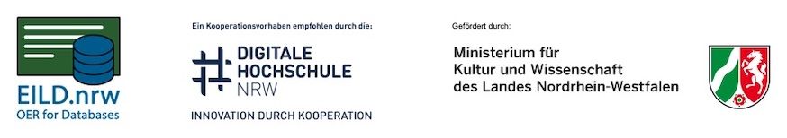

# Lernmodul Datenbankverbindungen mit Python

In diesem Jupyter-Notebook werden die Anweisungen der Python-API (DB-API 2.0) mit einer kleinen Datenbank erklärt. Auch wird die Verwendung einer in Python programmierten Prozedur im DBMS gezeigt. Die Beispiele können interaktiv ausgeführt werden. Als DBMS wird SQLite ohne Persistierung verwendet. Vorausgesetzt werden:
- Grundkenntnisse Python
- Grundkenntnisse SQL

Die Dauer der Bearbeitung beträgt 15 bis 20 Minuten.


## Start mit Binder 

Mit Hilfe des Binder-Services kann das Modul ohne Installation dierekt im Browser benutzt werden.

Starten: [](https://mybinder.org/v2/gh/orca-nrw/lm-database-with-python/HEAD?urlpath=notebooks%2FDatenbankzugriff.ipynb) Das Modul lädt etwas 3 Minuten!

## Start mit Docker

Mithilfe der folgenden Befehle kann das Lernmodul auch lokal in einem Docker Container gestartet werden:

```
git clone https://github.com/orca-nrw/lm-database-with-python.git && cd lm-database-with-python
docker build -t lmdbaccess:1.0 .
docker run -p 8888:8888 lmdbaccess:1.0
```
Die URL zum Aufrufen des Jupyter-Notebooks wird in der Konsole angezeigt und das Modul kann im Browser verwendet werden.

### Über dieses Lernmodul

Dieses Lernmodul wurde von Björn Salgert im Rahmen des EILD.nrw-Projektes erstellt, nähre Informationen unter [eild.nrw](https://eild.nrw). Die nicht anders lizenzsierten Bestandteile dieses Lermodules können unter der CC-BY-NA-Lizenz genutzt werden.


